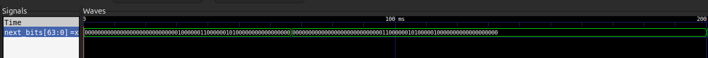
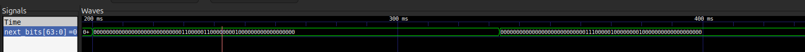
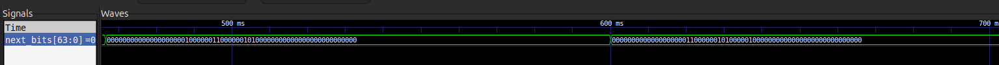
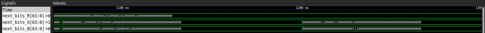
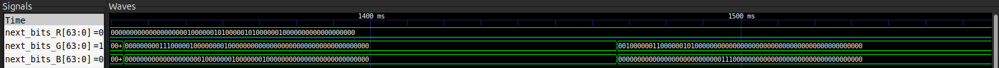
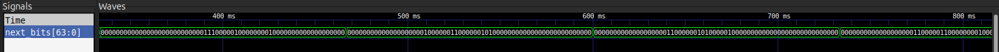

# Game of Life Implementation

This project implements Conway's Game of Life on the iceBlinkPico and displays it on an 8×8 WS2812 LED matrix. I created three main implementations in my process. Two of these were able to be uploaded to the iceBlinkPico. `top` is the only module that changes among the implementations so the below module descriptions are descriptions of the modules that don't change. In general the top level modules don't differ that much but they do result in different effects.

The three implementations are as follows and are in their respective directories:
- `single_color`: this is just a simple one color single game implementation that I used to get the overall mechanics of the game working. I iterated from here.
- `rainbow`: plays a single game on the LED grid but cycles the LED colors through the HSV color wheel as the game is played
- `three_color_attempt`: an attempt at getting three games to play at once, one on each color channel. This one did not turn out in hardware.

## Architecture Overview

The design combines a Game of Life cellular automaton engine with a WS2812 LED driver and top level control logic to play the game on the LED grid.

## Module Descriptions

### `controller.sv`
**Purpose:** Orchestrates per-pixel transmission timing and inter-frame synchronization for the WS2812 LED matrix. This module is nearly identical to the provided `led_matrix`. The only change I made was adding output logic for when the module is in an idle state. This gets used in `top` to ensure proper updating.

### `game_of_life.sv`
**Purpose:** Computes the next generation of an 8×8 Conway's Game of Life grid with wrap-around topology given the current state of the cells.

**Algorithm:**

The algorithms use several nested `for` loops and `if` statements to iterate through all the cells and check and count the alive neighbors of each cell. This implementation is very resource intensive and created problems for me when I tried to implement three games at once. Modular division is used to account for wrap around effects. The overall design is simple and allows everything to happen during one rising edge when its time to update the board but doing it on one clock edge required a lot of logic devices. A better implementation may be to allow the game states to be calculated and stored over several clock edges. I tried doing this but was not successful unfortunately.

The module takes the clock, an update signal, and the current state of the game as inputs and the output is the next state of the game that will them be displayed on the grid. The output is a binary 1 for alive cells and 0 for dead cell which then is used to set the brightness and colors of the LEDs once piped into `top`.

### `memory.sv`
**Purpose:** Synchronous ROM/RAM with optional hex file initialization (not used in this project). This is identical to the module in the `led_matrix` example.

### `ws2812b.sv`
**Purpose:** Generates WS2812-compatible bit waveforms with precise timing control. This is identical to the module in the `led_matrix` example.

### `top.sv`
**Purpose:** Top-level integration bringing together all components control logic and Game of Life updates.

**Game of Life Integration:**
`top` uses a timer and counter `copy_counter` to determine when the `game_of_life` module should update. Once the counter reaches the `AUTO_UPDATE` value, update signals are turned true, and assuming the controller is in an update state and not processing or sending data, data can be written to a buffer which then is fed into a data register variable for the LED grid.

**Data Flow:**
1. Controller specifies which pixel to send via `pixel[5:0]`
2. On `load_sreg`, `data_reg` is loaded from frame buffer
3. `shift_reg[23:0]` is populated with GRB data based on current color
4. WS2812 module shifts out bits while controller holds `transmit_pixel` high
5. After all 64 pixels, controller enters idle period
6. During idle, if an update is pending, frame buffer is updated from Game of Life results

## `single_color`
This module uses the above described steps and plays the game on the green color channel. This was the base case that I used as a proof of concept of the implementation. I set the starting pattern in `top` and the game plays successfully on the grid.

### Simulation Results
The `next_bits` logic is the best signal to analyze in the simulation since it shows in 1D how the board changes over time. It is 64 bits, one bit for each LED. It does not show the hex values but does show a 1 if a cell is alive and a 0 if it is dead. The 1D nature does make it slightly challenging to interpret but changes in cells are apparent as you look at different time steps. 

### Video of `single_color` Implementation
`/single_color/single_color.mp4`: The glider pattern can be seen moving across the grid on the green color channel.

## `three_color_attempt`
My original plan was to have three different games playing at once on the LED grid, one on each color channel. I adapted my single color implementation and duplicated the necessary components (`frame_buffer`, `next_bits`, `data_reg`, etc) so each color channel could keep track of its own state. In order for this to work with my implementation, I needed to instantiate three `game_of_life` modules which is where I ran into problems. Upon doing so and trying to compile it, an error was thrown because it required more logic components than the ice FPGA has available. This implementation required over 270% of the available resources which meant it was impossible to upload to the iceBlinkPico and test. The problem is tied to how resource intensive my `game_of_life` module is. It uses the nested `for` loops and `if` statements

### Simulation Results
Some success could be seen in simulation. Looking at each channels `next_bits` you can see proper behavior overall. The red channel starts in the Beehive formation which is stable and it is apparent that the cells don't change state which is. The green channel follows the glider pattern and the changes in cells can be seen. The blue channel follows the cross pattern and the alternating values is also apparent. With my implementation, it is essentially jus the single color implementation instantiated three times so the other mechanics in `top` should not change so I believe there is a high chance this implementation would have worked had the FPGA had more resources.

## `rainbow`
In the interest of still exploring using the RGB LEDs to create an interesting effect, I decided to explore having the LEDs cycle through the HSV color wheel similar to how we did in the previous mini projects. This implementation uses almost the same framework as the `top` in the `single color` implementation but now has a state machine that takes a `current_color` variable that sends colors to the color channels in accordance to whatever color the current state is. The colors cycle through the HSV color wheel every second. The new color applied in accordance to when new data is send to the grid after a color change. The color change and updates do not perfectly align but having the time between color changes being longer makes it strobe less and more apparent to they eye.

### Simulation Results
This example also shows the glider pattern as it moves along grid. The color changes can also be seen. These color changes happen in 200ms intervals

### `rainbow.mp4` - Video of `rainbow` Implementation
`rainbow/rainbow.mp4`: The video shows several seconds of the glider pattern traversing across the grid. The colors continuously change across the HSV color wheel as the glider movies.
