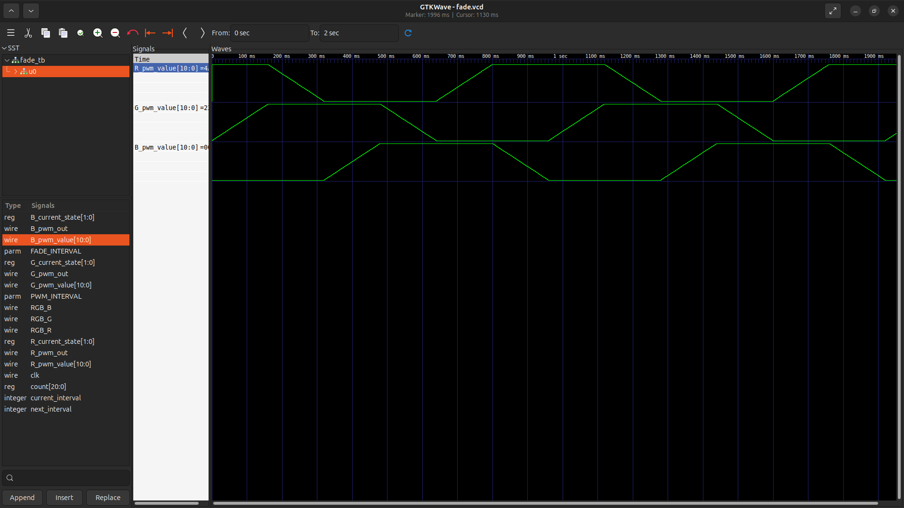

# Mini Project 2
The goal of Mini Project 2 is to to drive the RGB LEDs on the [iceBlinkPico](https://github.com/bminch/iceBlinkPico/) so that they smoothly cycle through the colors on the HSV color wheel.

## Implementation
My implementation is adapted from the [fade](https://github.com/bminch/iceBlinkPico/tree/main/examples/fade) example for the iceBlinkPico. As with the example, the main implementation contains three source files:
- `fade.sv` - adapted from example
- `pwm.sv` - adapted from example with minor change
- `top.sv` - adapted from example

### `fade.sv`

The fade module controls the brightness of an LED by generating a PWM value that changes over time. The PWM value ranges from 0 (LED off) to `PWM_INTERVAL - 1` (LED fully on), and the step size for each increment or decrement is set by `INC_DEC_VAL`, calculated from the total PWM range and the number of steps. The module uses a counter to determine when to update the PWM value and allows for control over fade speed.

State transitions are handled externally in `top.sv`, which allows for coordinated control of all LEDs. The fade module responds to a 2-bit `current_state` input and selects one of four behaviors:

- Incrementing (`PWM_INC`): Gradually increases the PWM value making the LED brighter
- Decrementing (`PWM_DEC`): Gradually decreases the PWM value dimming the LED
- High Hold (`HIGH_HOLD`): Holds the PWM value at its maximum keeping the LED fully on
- Low Hold (`LOW_HOLD`): Holds the PWM value at zero turning the LED off

When the increment/decrement counter determines it is time for an update, the state machine checks the current state:
- If incrementing or decrementing, the PWM value changes by `INC_DEC_VAL` (with overflow/underflow protection).
- If in either hold state, the value is set to max (high hold) or 0 (low hold).

The module updates the PWM value only at intervals defined by the counters, controlling the timing and smoothness of the fade. Parameters like `INC_DEC_INTERVAL` and `INC_DEC_MAX` adjust fade speed and resolution.

**Example:**
Suppose the red LED is set to incrementing. Every `INC_DEC_INTERVAL` clock cycles, the PWM value increases by `INC_DEC_VAL` until it reaches maximum, then transitions to high hold. The same logic applies for decrementing and holding states which creates the color blending.

When the increment/decrement counter determines it is time for an increment/decrement to happen, the state machine finds the case and if the current state is incrementing or decrementing, the PWM value will change accordingly. If in either of the hold states, the value will be set again to the max if high holding and 0 if low holding.

The step size for each increment or decrement is set by `INC_DEC_VAL`, calculated from the total PWM range and the number of steps. The module updates the PWM value only at intervals defined by the counters. This allows for control over fade timing and brightness levels for color mixing.

### `pwm.sv`

The `pwm` module, adapted from the example, generates a variable duty cycle signal to control the brightness of an LED. It uses a counter to compare against the input `pwm_value`, producing a high output for part of the cycle and low for the rest thus creating a PWM waveform. 

In the original example, the `pwm_out` signal could go high for one clock cycle when `pwm_value` was zero, causing the LED to pulse briefly when it should remain off. While this pulse is too fast to see, it was visible in simulation and technically the LED wasn't holding off completely. To fix this, the adapted implementation checks if `pwm_value` is zero and forces `pwm_out` low in that case; otherwise, it uses the standard logic (`pwm_out = (pwm_count > pwm_value) ? 1'b0 : 1'b1;`).

This change corrects the output behavior and prevents unwanted pulses in simulation and hardware.

### `top.sv`
The `top` module coordinates the color fading of the RGB LEDs by cycling through intervals on the HSV color wheel. It uses two enums: one for the current state of each LED (incrementing, decrementing, high hold, low hold), and one for the current interval of the HSV cycle (six segments, each representing 60 degrees).

A timer counter counts clock cycles to determine when to advance to the next HSV interval (every 0.2 seconds). For each interval, a combinational state machine individually sets the state of the red, green, and blue LEDs, controlling whether each channel is fading up, fading down, held high, or held low. This mapping creates smooth color transitions as the module cycles through the HSV wheel. The state machine also sets the next HSV interval.

Each color channel instantiates a fade module (to generate a PWM value based on its state) and a pwm module (to convert the PWM value into an on/off signal for the LED). The outputs are inverted before being assigned to the RGB LED pins to account for the active-low LED operation.

Overall, the top module orchestrates the timing and state transitions needed for continuous color fading across the HSV color wheel spectrum.

## Simulation
The below simulation results show the changing duty cycle of for each LED. It creates a trapezoid wave similar to the wave created by plotting the HSV color wheel.

## Video
The video `rgb_fade.mp4` shows several cycles of the LEDs fading and shows colors across the HSV spectrum.

## Report
This README but in a PDF file
